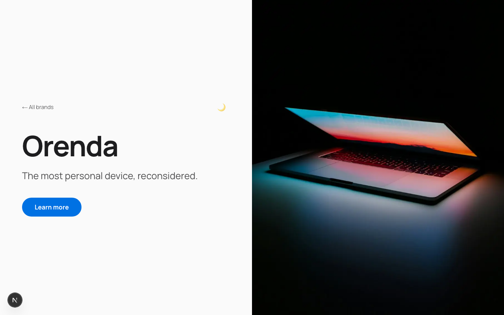
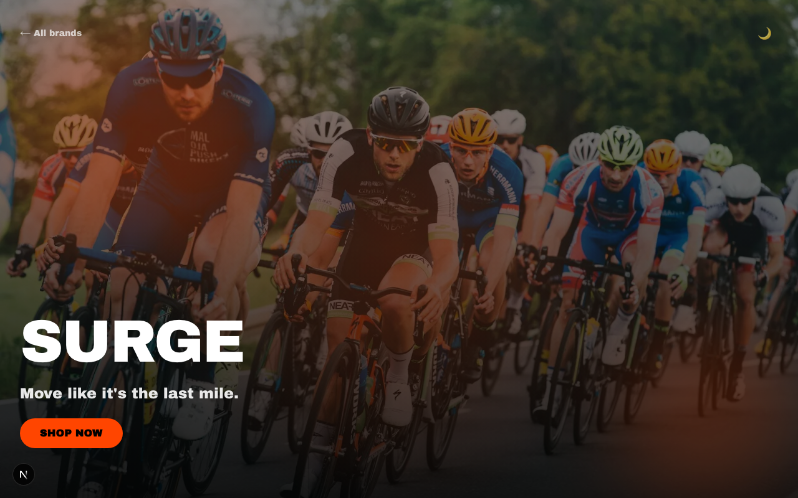
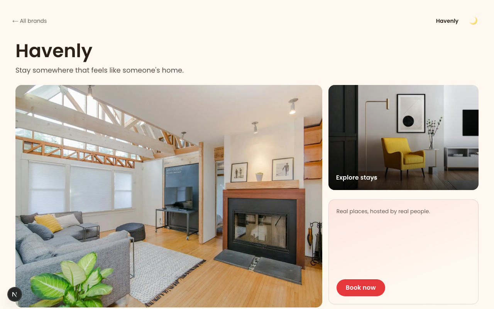
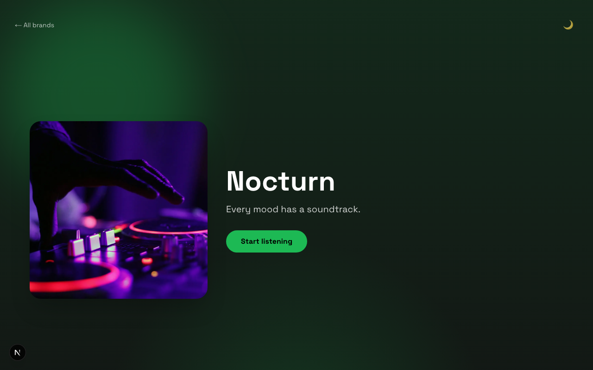
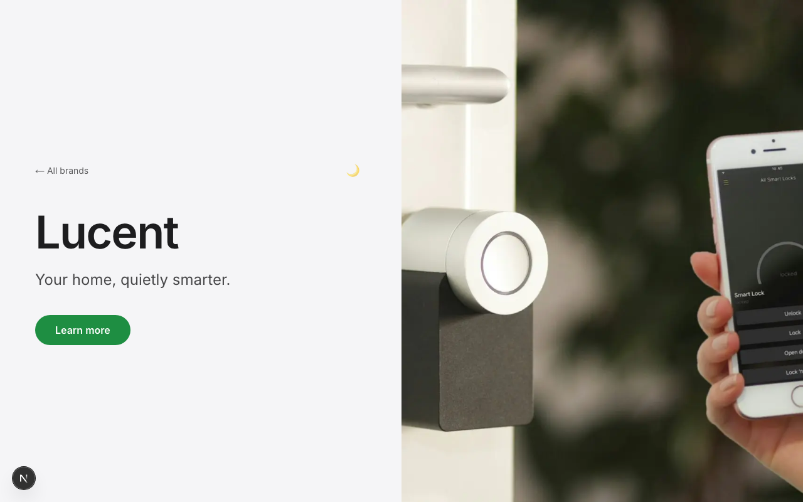
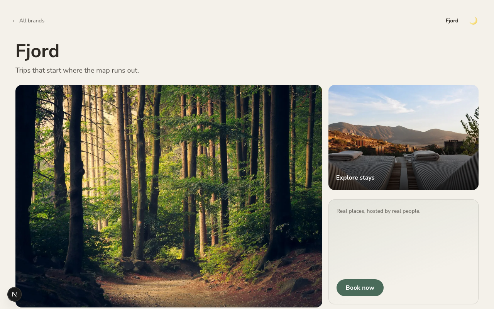
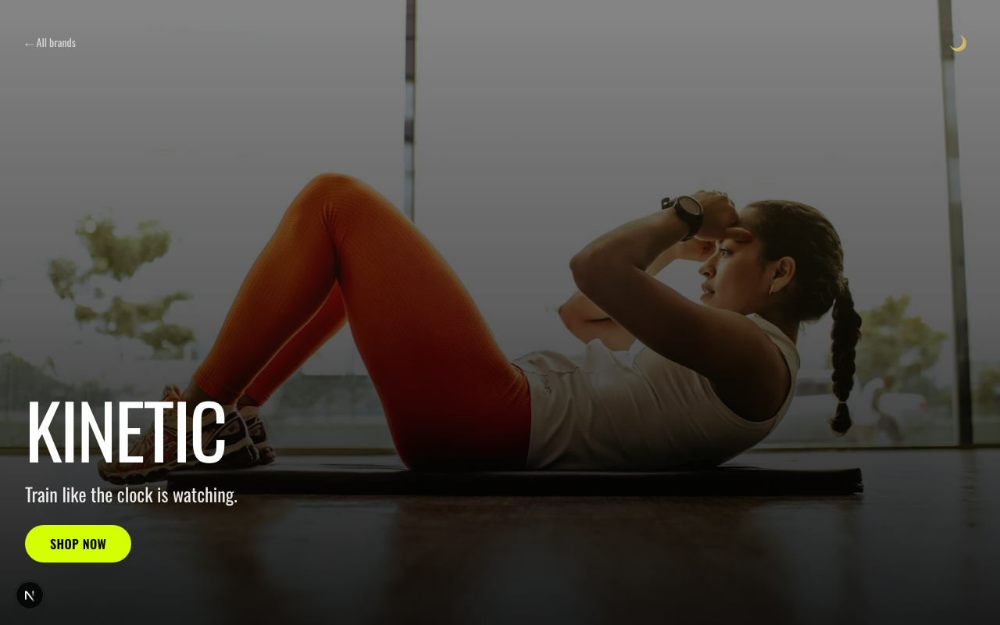
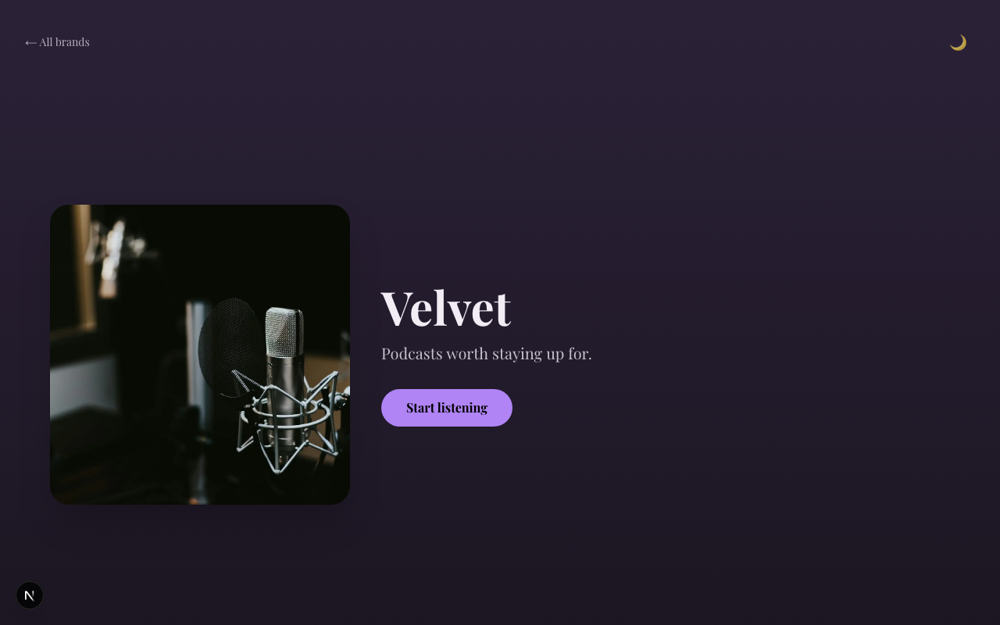
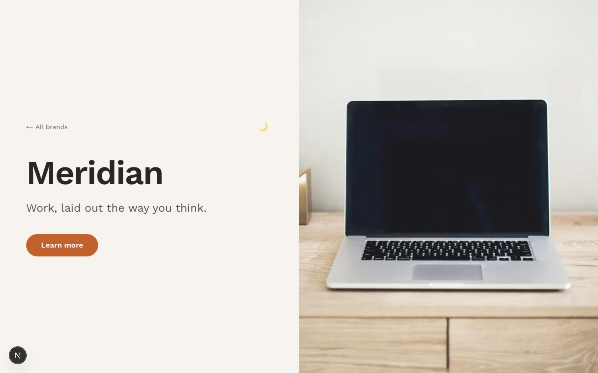
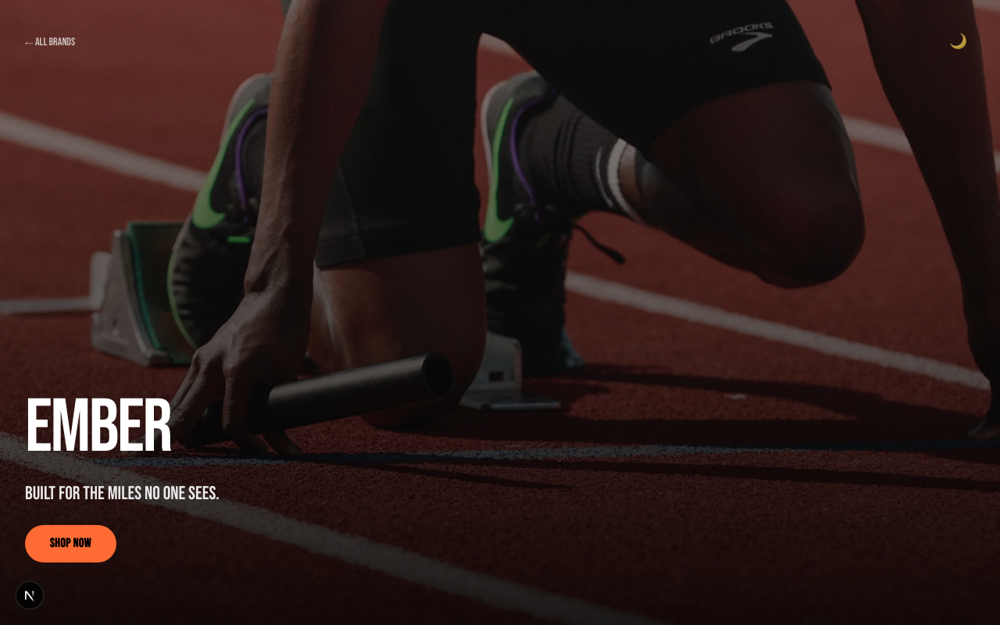

# 10 Brands, 10 Aesthetics

Ten fictional products, each styled after a different iconic consumer landing
page (Apple, Nike, Airbnb, Spotify-style) — no real logos, names, or copy. A
speed test of producing polished, distinct-feeling landing pages fast with AI
help, planned end-to-end with `/office-hours`, `/plan-ceo-review`, and
`/plan-eng-review` before a line of code was written.

**Build time:** started 2026-09-11 08:26 SAST (scaffold) — finished 08:32
SAST for the first working version. About 6 minutes of actual build time, on
top of a planning pass through `/office-hours` → `/plan-ceo-review` →
`/plan-eng-review` beforehand. Several follow-up passes (image/copy fixes,
motion, dark mode, OG images) landed afterward based on direct feedback.

## Gallery

| | | |
|---|---|---|
| [](docs/screenshots/orenda.png) | [](docs/screenshots/surge.png) | [](docs/screenshots/havenly.png) |
| Orenda — Apple-style | Surge — Nike-style | Havenly — Airbnb-style |
| [](docs/screenshots/nocturn.png) | [](docs/screenshots/lucent.png) | [](docs/screenshots/fjord.png) |
| Nocturn — Spotify-style | Lucent — Apple-style | Fjord — Airbnb-style |
| [](docs/screenshots/kinetic.png) | [](docs/screenshots/velvet.png) | [](docs/screenshots/meridian.png) |
| Kinetic — Nike-style | Velvet — Spotify-style | Meridian — Apple-style |
| [](docs/screenshots/ember.png) | | |
| Ember — Nike-style | | |

Screenshots are auto-captured, not hand-picked — see [Scripts](#scripts) below.

## Running locally

```bash
npm install
npm run dev
```

Open [http://localhost:3000](http://localhost:3000) — the gallery links to
all 10 brand pages. On any brand page:
- Press **← / →** to cycle through all ten.
- Click the 🌙/☀️ toggle to switch between each brand's light and dark palette.

## How it's built

- **One dynamic route** (`app/[slug]/page.tsx`) driven entirely by
  `lib/brands.ts` — each of the 10 entries picks a `layoutArchetype`
  (`minimal-hero`, `bold-motion`, `photo-grid`, `dark-gradient`) so pages
  differ structurally, not just in color/font.
- **4 archetype components** under `components/archetypes/` — adding an
  11th brand is a config entry, not a new page (see [Add a new
  brand](#add-a-new-brand) below).
- **Light/dark mode per brand** — every brand has a `palette` and a
  `darkPalette`; a toggle (`components/ThemeToggle.tsx`) switches between
  them, persisted to `localStorage` and defaulting to the visitor's OS
  preference (`lib/theme.tsx`).
- **Auto-generated social preview images** — `app/[slug]/opengraph-image.tsx`
  renders each brand's name, tagline, and accent color as a shareable OG
  card (always the light palette, so there's one per brand, not two).
- Hero imagery is hand-picked Unsplash photography with a blur-up
  placeholder and a static fallback if a URL ever fails to load.
- Two "hero-tier" pages (Surge, Nocturn) get an extra animated
  spotlight/glow treatment (`components/HeroSpotlight.tsx`) — a lightweight
  Framer Motion effect standing in for a heavier Aceternity/Three.js
  component, kept isolated to those two pages only.
- Motion throughout: feature/stat/testimonial/CTA sections fade in on
  scroll, buttons have a spring hover/tap response, and gallery cards lift
  with an accent-colored ring on hover.

## Add a new brand

This repo is built so a new brand is a config entry, not a new page:

1. Open `lib/brands.ts` and add an entry to the `BRANDS` array with:
   - `slug`, `name`, `tagline`, `brandInspiration`
   - `palette` and `darkPalette` (each `{ bg, fg, accent }`) — run
     `npm run check:contrast` after picking colors; it fails the build if
     any combination doesn't meet WCAG AA.
   - `fontKey` — one of the fonts already declared in `lib/fonts.ts`, or add
     a new `next/font/google` import there first.
   - `layoutArchetype` — one of `minimal-hero`, `bold-motion`, `photo-grid`,
     `dark-gradient` (see `components/archetypes/`).
   - `heroTier` — `true` only if you want the animated spotlight treatment
     (keep this rare; it's meant to stay a 1-2 page showpiece).
   - `heroImage` / `heroImageAlt` — a direct `images.unsplash.com` CDN URL
     (not a `unsplash.com/photos/...` page URL) plus descriptive alt text.
   - `features` (exactly 3), `stats` (exactly 3), `testimonial`, and
     `ctaHeadline`.
2. Run `npm run dev` and visit `/your-slug` to check it.
3. Run `npm run check:contrast` to confirm both palettes pass.
4. Run `npm run capture:gallery` (with the dev server running) to refresh
   the README screenshots, then update the [Gallery](#gallery) table above.

## Scripts

```bash
npm run check:contrast   # WCAG AA contrast check for every brand's light + dark palette
npm run capture:gallery  # screenshots every page into docs/screenshots/ (needs `npm run dev` running)
```

## Manual QA

See the test plan checklist produced by `/plan-eng-review` for the full
pre-ship checklist (gallery navigation, keyboard nav, image fallback, 404
handling, and the fresh-clone-to-deploy path).

## Deploying

Push to a GitHub repo and import it on [Vercel](https://vercel.com/new) —
zero config needed, `next.config.ts` already allowlists the Unsplash image
domain.
